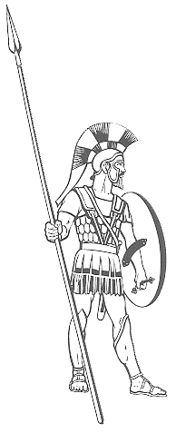

footer: mike@wire.com
# [fit] E2EE
# [End-to-End Encryption]
# [fit] for iOS Developer.
	
^ Good morning UIKonf! My name is Mike, and my surname is not possible to pronounce. Today I want to talk with you about something that I am working professionally with every day for quite some time. It's called _End-to-End encryption_. Don't worry just yet, over the course of my talk I am going to explain what it means and why someone might need it. But first things first, let's get introduced.

---
# Introduction.

- Graduated Master of Applied Mathematics at Odessa State `I.I.Mechnikov` University.
- 9 years in iOS development.
- 5 years berliner.
- Proud father of Alexander and Daniel.

^ So I studied applied mathematics at Odessa State University, since then worked on quite some projects. I am working and living in Berlin for quite some time now. And I moved to Berlin just to start working on the project that is known now as Wire.

---
# Motivation.

## Why I am giving this talk?

- Help devs understand what the end-to-end encryption is exactly about.
- Motivate to think about privacy when implementing the apps.
- Inspire to create the new E2EE apps.
- Inspired by Nadim Kobeissi (@kaepora).

^ So why I am giving this talk, again? I am happy to share my knowledge that I've developed while working at Wire with everyone. This includes some basic understanding what the end to end encryption is and I hope it can inspire more developers to take this approach or utilize it not only developing the messaging apps but also when working on the other solutions. Part of the motivation is of course to share the 
experience I've had while working in my current company: Wire.

---


[^1]

^ Wire.

[^1]: Image copyright: Wired magazine, all rights reserved.

---


[^2]

^ OK, not that Wire.

[^2]: Image copyright: I am sure it is copyrighted.

---
# About Wire.


- I am the part of the awesome iOS team at Wire.
- Wire is open-source 🎉: `https://github.com/wireapp/wire-ios` and other repos.
- Wire is one of the pioneers of End-to-End encryption: first version released in #TODO.
- Wire is available as the encrypted Slack replacement.

^ Ah yeah! That one. Wire is the fully end-to-end encrypted messenger platform. We are developing the secure and fun collaboration tool that you can use on all modern platforms. We where one of the pioneers of the E2EE.

---
# Disclaimer.

- I am not the inventor of E2EE.
- I am not responsible for the design of the encryption at Wire.

^ I think it is worth mentioning that I am not the one behind the original Wire protocol implementaiton. I know it on the level of the detail that is necessary to work with it and of course speaking about it on the iOS developers conference. 

---
# Prologue: The Invention.


^ In the king's age of the ancient Greece, the warriors used to have the shields that had only one handle - in the middle. Hence, it was not easy to hold that kind of shield and it was not big enough to cover the soldier's body. The people armed with this kind of shields had to fight spread one by one and was inferior comparing the horsemen, not mentioning the armoured knights or the chariots. 
However the horses, chariots and armour is not something that was possible for the common citizen to purchase.

---


Hoplite with their aspis [^3]

A hoplite was primarily a free citizen who was responsible for procuring his armour and weapon. Many famous personalities, philosophers, artists and poets fought as hoplites.

[^3]: Public domain, Either Edward J. Krasnoborski or F. Mitchell. - [website](http://www.au.af.mil/au/awc/awcgate/gabrmetz/gabr0066.htm).

^ The important innovation has changed the battelfield: the invention of the shield with two handles, where the hand is going until the elbow into one of the straps and holding the second one. This allowed holding the bigger shield, so the warriors could stand side by side creating the wall invulnerable for the enemy. 
This changed the balance on the battlefield making the footman infantry the primary force, where the footmen did not have to buy the expensive ammunition and horses any more. Those where now the regular citizens who can afford to buy or assemble the shield and the sword. Those who are the main force on the battlefield soon enough start to feel themselves the main force in the country. So the kings and nobleman are loosing the power in the state in favor of the regular citizens. So the democracy is born from the invention of the second handle on the shield.

---
# Bottomline.


# Forbidding encrypted messaging would not work.

---
# So what is End-To-End encryption, exactly?


---
# Defining the problem.

```
 Sender 🦊                       Receiver 🐸
+---------+          ?                              
| Message |  -----------------> 
+---------+              
```

^ Let's first understand the problem. It's really easy to articulate. The _Sender_ would like to communicate with the receiver and send receiver a message.

---
# Defining the problem.


^ The first and the most basic constraint is that neither Sender nor the Receiver would like anyone else except the receiver to read the message. Other _significant_ constraint is that it is not possible for sender and receiver to meet and exchange the keys offline.

---
# Solution 🎉: Public-key crypto: Diffie-Hellman (DH) key exchange or RSA.

```
 Sender 🦊  <----- Public keys ----> Receiver 🐸
```
1. Sender and receiver generate public and private key: $$K^{Publ}_{🦊}, K^{Priv}_{🦊}, K^{Publ}_{🐸}, K^{Priv}_{🐸}$$
2. They exchange public keys: $$📱_{🦊} \xrightarrow[{K^{Publ}_{🦊}}]{} 🐸$$, $$📱_{🐸} \xrightarrow[{K^{Publ}_{🐸}}]{} 🦊$$

^ Sure enough people familiar with the encryption would say that sender and receiver can use the public key crypto to exchange the public key information to generate the shared secret. They both, the sender and the receiver, generate the key pairs: public and private keys. Then they exchange the public keys and based on those generate the shared secret.

---
# Public-key crypto.

Using the Diffie-Hellman (DH) procedure, the shared secret key is created: $$K^{Shared}_{🦊🐸}$$

```
                    Secure channel
 Sender 🦊  <---- encrypted with the ----> Receiver 🐸
                   shared secret key
```

**This is how TLS work.**

---
# Problem 1: Reachability ⚠️

- Using the DH or RSA, both participants must be online in order to perform the key exchange.
- Not possible for reasons: phone or other device is not online.

---
# Solution.

- Receiver can publish his public key in advance to the server: $$📱_{🐸} \xrightarrow[{K^{Publ}_{🐸}}]{} 🌍$$.
- Next time someone wants to communicate with him it is possible to fetch the public key from the server:
$$🌍 \xrightarrow[{K^{Publ}_{🐸}}]{} 📱_{🦊}$$.

^ The participant who might want to receive the encrypted message might upload his public key in advance to the server.

---
# In Wire $$K^{Publ}_{🐸}$$ is called the Prekey.

---
# Problem 2: Credibility ⚠️

- What if someone generates another key pair: $$K^{Priv}_{🐊}, K^{Publ}_{🐊}$$.
- Upload it to the server pretending he is 🐸: $$📱_{🐊} \xrightarrow[{K^{Publ}_{🐊}}]{} 🌍$$.

---
# Problem 2: Credibility ⚠️

- Anyone who would like to talk with 🐸 will actually create the shared secret with 🐊!
- Then 🐊 can decide to create the shared secret with 🦊 and relay the messages reading them.

---
# Problem 2: Credibility ⚠️

- This is called ~~crocodile~~man-in-the-middle attack.

```
 🦊  <-- Secure channel --> 🐊 <-- Secure channel --> 🐸
```
---
# Solution: Key Verification 🔑.

- It is possible to sign the key with another private key.
- In HTTPs: the authority signatures (public keys) are saved in the keychain. 
- It is possible therefore to check the signature.
- In messaging: users must check the key fingerpints of the people they are communicating with.

---
# In Wire it is called the fingerprint verification.

---
# Problem 3: Forward secrecy.

- If the 🐊 would record all the encrypted communication between 🦊 and 🐸...
- And then find out the $$K^{Shared}_{🦊🐸}$$.
- All the previous communication can be decrypted.

---
# Solution: Session keys / Key rotation.

- Generate the new key for each message:
- Either do the new key exchange while exchanging the messages.
- When not possible (no messages coming back): rotate the key using the Hash Key Derivation Function (HKDF) - basically hash the previous key.

---
# Why good E2EE was not available earlier?

- The performance of the keypair $$K^{Publ}_{🦊}, K^{Priv}_{🦊}$$ generation improved dramatically, since:
- Elliptic curve crypto development.
- CPU performance improvements.

---
# How it applies to iOS.
        
- Basics of not sharing the data with Apple.
- Push Notifications (APNs) 💔 E2EE.
- Share extension + E2EE.

---
# Basics of not sharing the data with Apple.

- Apple cares about user privacy.
- iTunes and iCloud backups.
- CallKit 🤙.

^ Apple is one of the bigger companies that care about the user privacy. This does not mean that we can rest now and stop thinking about the users of our apps.

---
# Image and Video metadata.

Every image or video taken on the iPhone has a significant amount of embedded metadata:
- Device location 📍.
- Model 📱.
- Camera information 📷.

---
# Strip metadata using `ImageIO`.

Load image from `Data` to `imageSource` [^4]:

```swift
guard let imageSource = CGImageSourceCreateWithData(data, nil),
      let type = CGImageSourceGetType(imageSource) else {
    throw MetadataError.unknownFormat
}
```

[^4]: Source: https://github.com/wireapp/wire-ios-images/blob/develop/Sources/Image%20Processing/NSData+MediaMetadata.swift

---
# Strip metadata using `ImageIO`.

Create the new image `imageDestination`:

```swift
let count = CGImageSourceGetCount(imageSource)
let mutableData = NSMutableData(data: self as Data)
guard let imageDestination = CGImageDestinationCreateWithData(mutableData,
                                                              type, 
                                                              count, 
                                                              nil) else {
	throw MetadataError.cannotCreate
}
```

---
# Strip metadata using `ImageIO`.

Reset the metadata:

```swift
for sourceIndex in 0..<count {
    CGImageDestinationAddImageFromSource(imageDestination, 
                                         imageSource, 
                                         sourceIndex, 
                                         nullMetadataProperties)
}

guard CGImageDestinationFinalize(imageDestination) else {
    throw MetadataError.cannotCreate
}
```

---
# iTunes and iCloud backups.

- The content of the backup is stored plaintext in the iTunes or (even worse) in the iCloud.
- Since we care not to put user data on our backend, we also have to care not to put it on the Apple backend.

---
# iTunes and iCloud backups.

Like that[^5]: 

```swift
var resourceValues = URLResourceValues()
resourceValues.isExcludedFromBackup = true
try mutableURL.setResourceValues(resourceValues)
```

[^5]: Source: https://github.com/wireapp/wire-ios/blob/develop/WireExtensionComponents/Utilities/URL%2BBackup.swift

---
# CallKit.

- CallKit used to sync the calls metadata between the devices.
- iOS 11 fixed that.

---
# Push Notifications (APNs) 💔 E2EE.

- The message sent via the push notification is visible to Apple.
- APNs allows sending the "VoIP Puhs Notifications".
- Using **VoIP** push, the iOS application can run the code while not active.
- During this time, the application must fetch the message from the backend and display the local push

---

```
+---------+         +-----------+      +---------+    +----------+
| Your    |         | APN Apple |      | Sender  |    | Receiver |
| Backend |         | Backend   |      |         |    |          |
+----+----+         +-----+-----+      +----+----+    +----+-----+
     |                    |                 |              |
     | <---Encrypted message for Receiver---+              |
     |                    |                 |              |
     +---Content APN----> |                 |              |
     |                    |                 |              |
     |                    +---"Content available" APN----> BG
     |                    |                 |              BG
     | <----Fetching the new messages--------------------+ BG
     |                    |                 |              BG
     |                    |                 |              BG
     |                    |                 |              |
```

---
# Problems.

- If the client cannot manage to fetch the message content from the backend in time, the push notifications are not going to be delivered.
- If the push notification receiver is offline, then the push notification scheduler can drop some notifications, so the client would not have a chance to fetch messages.

---
# Possible solution: Background Fetch.

- It is possible to enable the background fetching, so when the device comes online the app would have the chance to fetch messages.


```swift
application.setMinimumBackgroundFetchInterval(timeInterval)
```

---
# Share Extensions 💔💔💔 E2EE.

- On iOS, the share extension is the separate process.
- Database and the crypto material must be moved to the shared container.
- File sync is necessary.

---
# Big chats 🤕 E2EE.

- The message must be delivered to each participant.
- To the each participant's device!
- So when you send one message, say 1 Kilobyte of data in the conversation with N participants where each participant has K devices you actually have to send $$ 1 Kilobyte \times N \ times K $$ messages.
- 100 participants, each have 5 devices: **0.5 Megabyte**.

---
# Is it worth it?

As every tech out there, E2EE has it pros and cons.
- Harder to implement.
- Need to think.
- Less points of failure.

---
# Points of failure.

- Probability of the data leak $$ 0 < P(💧) \ll 1$$. 
- For $$N$$ points: total probability is $$\bigcup_{i=1}^{N}P(💧_i) = P_💦$$. 
- Let's remove the point $$N$$: $$\bigcup_{i=1}^{N-1}P(💧_i) = P'_💦$$. 
- $$P_💦 > P'_💦$$.

^ Let's define the probability of the data breach as P-leak, where P is between zero and one. It can never be zero, but can be one if your app really sucks. Given you have _N_ points where the data is travelling through, the total leak probability is the probability of leak happening on any point. 
Reducing the amount of points of failure to N minus one, i.e. removing one arbitrary point of failure is always making the failure less likely to happen.

---
# Sneak peek: MLS.

- MLS stands for the message `Messaging Layer Security`.
- IETF initiative to develop the common protocol for secure instant messaging.
- The protocol is being developed in cooperation between IETF, Twitter, Mozilla, Google, Facebook and Wire.

---
# MLS: Stay tuned!

- Improves the message sending in the big (>100) group conversations.
- One standard that can potentially unify the different messengers.
- https://www.ietf.org/mailman/listinfo/MLS
- https://datatracker.ietf.org/doc/draft-omara-mls-architecture/

---
# Thanks!

[Security Whitepaper](https://wire-docs.wire.com/download/Wire+Security+Whitepaper.pdf)

 [github.com/mikeger](github.com/mikeger)

 [twitter.com/GerasimenkoMiha](twitter.com/GerasimenkoMiha)

  CC BY 4.0 

